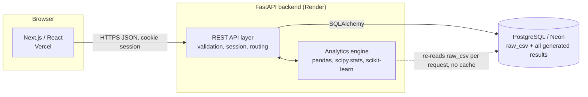

# InsightForge

Self-serve, automated data analytics platform. Upload a CSV and get an automated data-quality audit, exploratory data analysis, auto-selected statistical testing, a baseline predictive model with plain-language feature importance, an interactive "what-if" prediction simulator, and a one-click PDF report — no code required.

**Live app:** [insight-forge-beta.vercel.app](https://insight-forge-beta.vercel.app) · **API docs:** [insightforge-api-muyx.onrender.com/docs](https://insightforge-api-muyx.onrender.com/docs)

Built as a full SDLC exercise — requirements → design → implementation → testing → deployment, each phase documented — rather than a single-script notebook, to demonstrate how analytics tools are actually engineered.

Full requirements and design: [InsightForge_SRS_v1.0.docx](InsightForge_SRS_v1.0.docx) (feasibility study, functional/non-functional requirements, risk analysis), [InsightForge_Design_Phase_v1.0.md](InsightForge_Design_Phase_v1.0.md) (architecture, DB schema, REST API spec), [schema.sql](schema.sql).

## What it does

| Stage | Feature | Requirement |
|---|---|---|
| Ingest | Drag-and-drop CSV upload (≤10MB), validated for type/size/encoding | FR-1, FR-2 |
| Quality | Missing values, dtype inference, duplicate rows, IQR outlier flags per column | FR-3 |
| Explore | Histograms per numeric column, frequency charts per categorical column, correlation matrix | FR-4 |
| Test | Auto-selected t-test / ANOVA / chi-square by column type, with a plain-language conclusion | FR-5, FR-6 |
| Report | One-click PDF summarizing everything generated so far | FR-7 |
| Model | Baseline random-forest regression/classification, auto-selected by target type, with an 80/20 train/test split | FR-8 |
| Explain | Feature importance turned into a plain-language "strongest predictors" sentence | FR-9 |
| Simulate | Interactive sliders/dropdowns — drag an input, see the trained model's live prediction update | FR-10 |

Every stage is computed fresh from the stored raw CSV rather than cached, so results always reflect the latest state — see the [milestone docs](#milestones) for the reasoning behind that and the other non-obvious decisions along the way.

## Architecture

Three-tier: Next.js frontend → FastAPI backend (REST + a pandas/scipy/scikit-learn analytics engine) → PostgreSQL, with the raw CSV itself stored as a `bytea` column rather than on disk (Render's free-tier disk is ephemeral) or in a separate object store (out of the zero-budget constraint).



See [InsightForge_Design_Phase_v1.0.md](InsightForge_Design_Phase_v1.0.md) for the full schema (5 tables: `sessions`, `datasets`, `columns_profile`, `test_results`, `model_runs`) and REST API spec.

## Stack

| Layer | Technology |
|---|---|
| Frontend | Next.js 16 / React 19 / Recharts / Tailwind, deployed on Vercel |
| Backend | FastAPI, deployed on Render (Docker) |
| Analytics | pandas, scipy.stats, scikit-learn, reportlab (PDF) |
| Database | PostgreSQL via Neon |
| Testing | pytest (backend), Vitest + React Testing Library (frontend) |
| CI | GitHub Actions — lint, typecheck, test, build on every push |

## Testing

153 automated tests across both layers, run in CI on every push:

- **Backend** — 106 pytest cases (`backend/tests/`) covering validation edge cases, profiling correctness, EDA/stats/modeling logic, API-level session isolation, and several regression tests pinned to real bugs caught during development (see [decisions worth remembering](#milestones) in each milestone doc — e.g. Postgres JSONB not preserving dict key order, or a PDF library crashing on unescaped user text).
- **Frontend** — 47 Vitest + React Testing Library cases (`frontend/src/components/__tests__/`) covering client-side validation, upload/error flows, chart rendering, and the debounced live-prediction flow.

```bash
cd backend && pytest
cd frontend && npm test
```

## Local development

### Backend

```bash
cd backend
python -m venv venv
venv\Scripts\activate        # Windows
pip install -r requirements.txt
cp .env.example .env         # fill in DATABASE_URL
uvicorn app.main:app --reload
```

API docs at `http://localhost:8000/docs`.

### Frontend

```bash
cd frontend
npm install
cp .env.local.example .env.local   # fill in NEXT_PUBLIC_API_URL
npm run dev
```

App at `http://localhost:3000`.

### Database

Create a free [Neon](https://neon.tech) project, then apply the schema:

```bash
psql "$DATABASE_URL" -f schema.sql
```

Existing databases provisioned before M1 also need the migration in [`migrations/`](migrations):

```bash
psql "$DATABASE_URL" -f migrations/001_add_duplicate_row_count.sql
```

## Deployment

- **Backend (Render)** — connect this repo, Render auto-detects [render.yaml](render.yaml) (Docker, `backend/`). Set `DATABASE_URL` (Neon connection string) and `CORS_ORIGINS` (deployed frontend URL) in the Render dashboard.
- **Frontend (Vercel)** — import this repo, set root directory to `frontend/`, add `NEXT_PUBLIC_API_URL` (deployed backend URL) as an env var.
- Both redeploy automatically on push to `main`.

## CI

GitHub Actions (`.github/workflows/`):
- **backend-ci** — `ruff check` + `pytest`, on any push/PR touching `backend/`.
- **frontend-ci** — `eslint` + `vitest` + `next build`, on any push/PR touching `frontend/`.

## Milestones

Every milestone was verified against the real production database and, once pushed, the live Vercel/Render URLs — not just locally. Each summary below documents what was built, how it was verified, and the non-obvious decisions (and a few real bugs caught before or shortly after going live) along the way.

| # | Milestone | Maps to | Status |
|---|---|---|---|
| M0 | Setup — repo, CI, deploy pipeline | Foundation | ✅ [Summary](InsightForge_M0_Summary.md) |
| M1 | Ingestion & QA — upload + data-quality report | FR-1, FR-2, FR-3 | ✅ [Summary](InsightForge_M1_Summary.md) |
| M2 | Auto-EDA — distributions, correlation matrix | FR-4 | ✅ [Summary](InsightForge_M2_Summary.md) |
| M3 | Statistical Testing — auto-selected test + interpretation | FR-5, FR-6 | ✅ [Summary](InsightForge_M3_Summary.md) |
| M4 | Reporting — PDF export | FR-7 | ✅ [Summary](InsightForge_M4_Summary.md) |
| M5 | Modeling — baseline model + feature importance | FR-8, FR-9 | ✅ [Summary](InsightForge_M5_Summary.md) |
| M6 | What-If Simulator — live prediction sliders | FR-10 | ✅ [Summary](InsightForge_M6_Summary.md) |
| M7 | Polish & Docs — README, architecture diagram, tests | NFR set | ✅ this document |

All SRS Phase-1 (MVP) and Phase-2 (Should-Have) functional requirements are complete and verified live.
